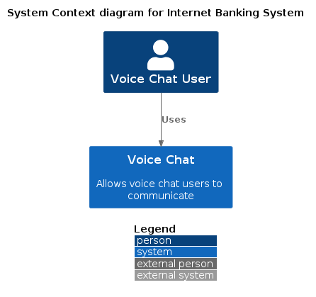
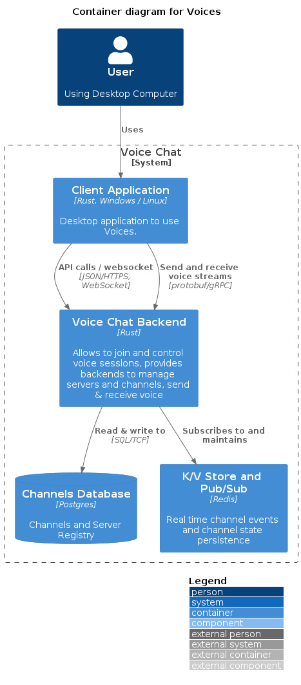
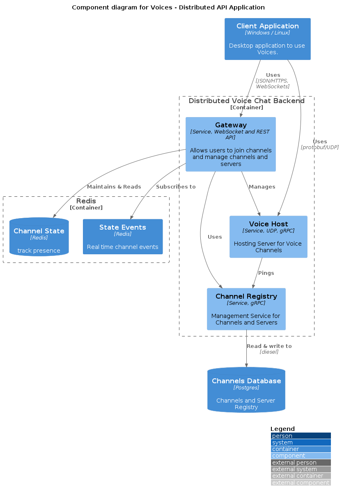
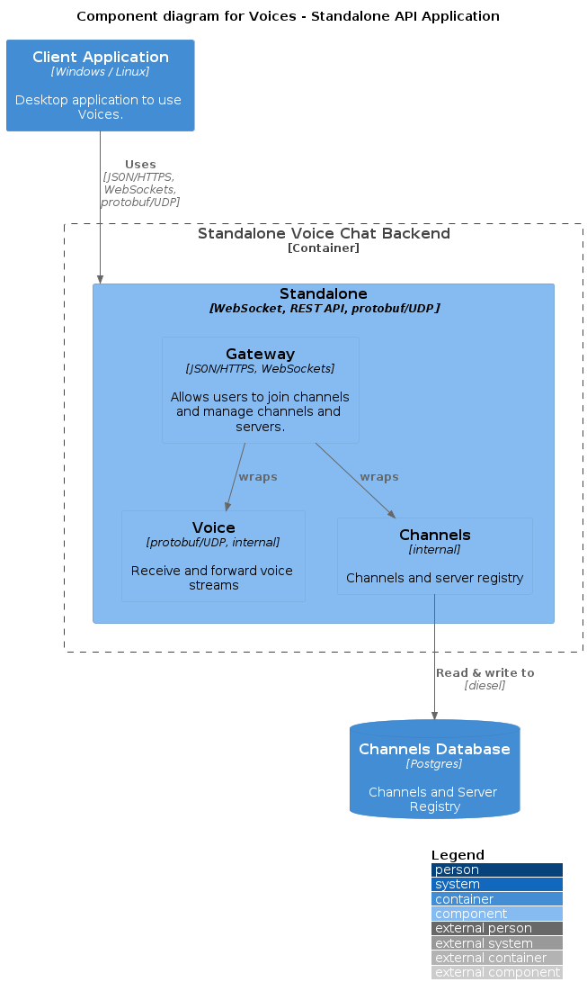

# System Diagram

The system context is quite simple, some voice chat user wants to use a voice chat to communicate with other voice chat users.

# Container Overview

The system consists of a client application running on a Desktop computer communicating with two backend components:

* Voice Chat Gateway API
* Voice Host

The Client Application talks to the Voice Chat Gateway API over JSON/HTTPS and JSON/WebSockets. The Voice Chat Gateway API offers endpoints to manage Channels and Servers, which are persisted in a Postgres database.

The Gateway also provides functionality to establish a Voice Chat session between Client and Voice Host.

Finally, the Gateway uses Pub/Sub and a Key-Value store provided by Redis to send and process real time channel events and to maintain the current channel state.

# Component Overview

## Distributed

## Standalone

